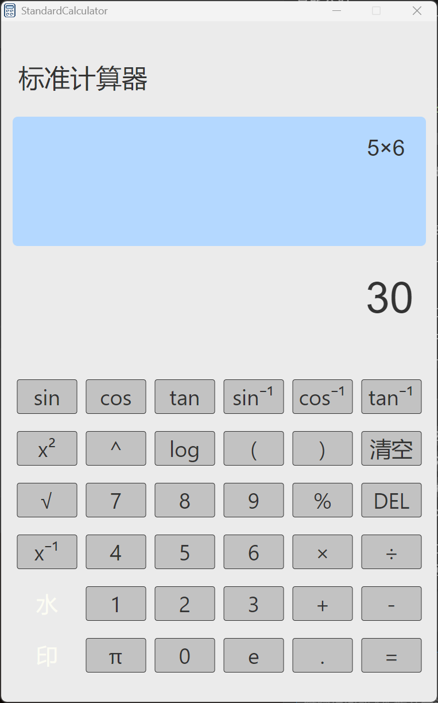

<h1 align="center">StandardCalculator</h1>

<p align="center">A StandardCalculator with Vue3 and TypeScript</p>

<p align="center">


</p>

<p align='center'>

</p>

## Next version

- [Standardcalculator2](https://github.com/aihixi/Standardcalculator2)


## Recommended IDE Setup

- [VSCode](https://code.visualstudio.com/) + [ESLint](https://marketplace.visualstudio.com/items?itemName=dbaeumer.vscode-eslint) + [Prettier](https://marketplace.visualstudio.com/items?itemName=esbenp.prettier-vscode) + [Volar](https://marketplace.visualstudio.com/items?itemName=Vue.volar) + [TypeScript Vue Plugin (Volar)](https://marketplace.visualstudio.com/items?itemName=Vue.vscode-typescript-vue-plugin)

## Project Setup

### Install

```bash
$ npm install
```

### Development

```bash
$ npm run dev
```

